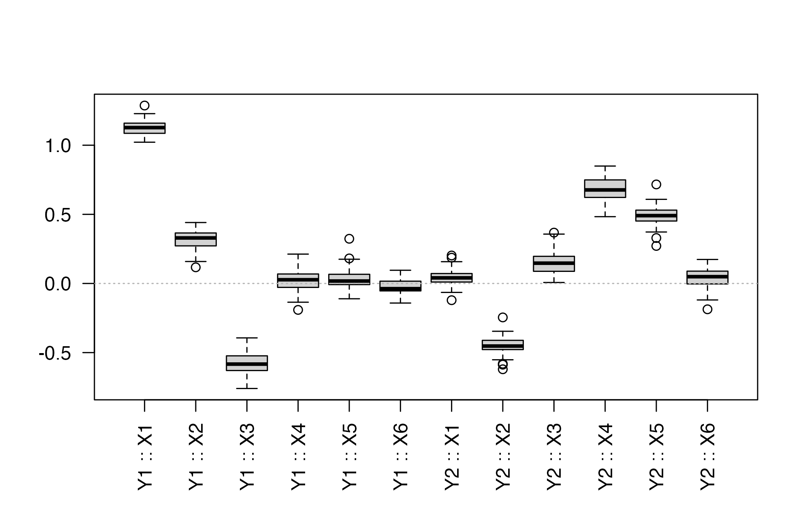
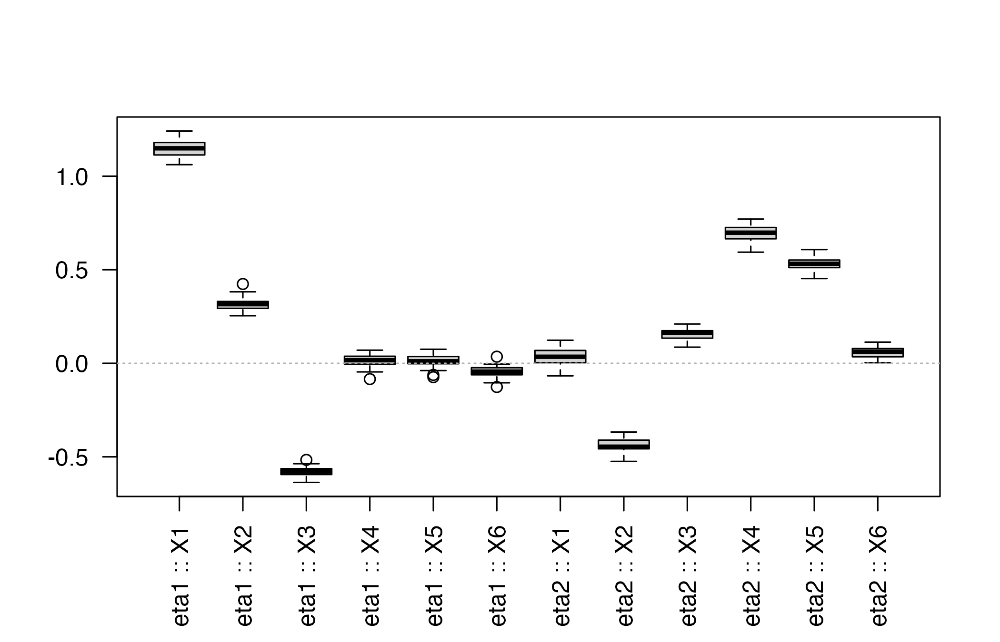

# Bootstrap strategies for bigPLSR

## Introduction

`bigPLSR` now provides two complementary bootstrap procedures:

- **(X, Y) bootstrap** refits the full regression model on resampled
  pairs.
- **(X, T) bootstrap** keeps the latent components of the original fit
  and resamples the score structure, delivering fast updates of the
  regression coefficients.

Both approaches expose percentile and BCa confidence intervals,
numerical summaries and plotting helpers.

We rely on a small multivariate example to illustrate the workflow.

``` r

library(bigPLSR)
n <- 100; p <- 6; m <- 2
X <- matrix(rnorm(n * p), n, p)
eta1 <- X[, 1] + 0.4 * X[, 2] - 0.6 * X[, 3]
eta2 <- -0.5 * X[, 2] + 0.7 * X[, 4] + 0.5 * X[, 5]
Y <- cbind(eta1, eta2) + matrix(rnorm(n * m, sd = 0.5), n, m)
```

## Baseline fit

``` r

fit <- pls_fit(X, Y, ncomp = 3, scores = "r")
```

## (X, Y) bootstrap

``` r

boot_xy <- pls_bootstrap(X, Y, ncomp = 3, R = 50, type = "xy",
                         parallel = "none", return_scores = TRUE)
head(summarise_pls_bootstrap(boot_xy))
#>   variable response        mean         sd percentile_lower percentile_upper
#> 1       X1       Y1  1.12720380 0.05483111       1.03357126       1.22790239
#> 2       X2       Y1  0.31715126 0.07184301       0.16076652       0.43387511
#> 3       X3       Y1 -0.58032760 0.07402063      -0.71756064      -0.44816272
#> 4       X4       Y1  0.01629040 0.07403399      -0.13117394       0.11615478
#> 5       X5       Y1  0.03428052 0.08010332      -0.09078452       0.17987746
#> 6       X6       Y1 -0.02468821 0.05931838      -0.14013792       0.07848342
#>     bca_lower  bca_upper
#> 1  1.07662505  1.2870309
#> 2  0.11687183  0.4120490
#> 3 -0.71386459 -0.3935652
#> 4 -0.18829055  0.1576646
#> 5 -0.09981499  0.3233262
#> 6 -0.14153533  0.0540529
```

A quick visual inspection of the coefficient distributions:

``` r

plot_pls_bootstrap_coefficients(boot_xy, variables = colnames(X))
```



## (X, T) bootstrap

The conditional bootstrap operates on the latent score representation
extracted from the baseline fit.

``` r

boot_xt <- pls_bootstrap(X, Y, ncomp = 3, R = 50, type = "xt",
                         parallel = "none", return_scores = TRUE)
head(summarise_pls_bootstrap(boot_xt))
#>   variable response        mean         sd percentile_lower percentile_upper
#> 1       X1     eta1  1.14632807 0.04497402        1.0672858      1.216945852
#> 2       X2     eta1  0.31388701 0.03309151        0.2577740      0.376551867
#> 3       X3     eta1 -0.57958235 0.02422587       -0.6339318     -0.539038171
#> 4       X4     eta1  0.01363128 0.03222957       -0.0448380      0.069097207
#> 5       X5     eta1  0.01377627 0.03246635       -0.0569404      0.072171472
#> 6       X6     eta1 -0.04337170 0.02979694       -0.1021070     -0.004940322
#>     bca_lower   bca_upper
#> 1  1.06165429  1.22675518
#> 2  0.25417756  0.38356573
#> 3 -0.62915894 -0.51626603
#> 4 -0.05084027  0.07010002
#> 5 -0.03361595  0.07498808
#> 6 -0.12270539  0.02059054
```

``` r

plot_pls_bootstrap_coefficients(boot_xt, responses = colnames(Y))
```



## Exploring bootstrap scores

When `return_scores = TRUE`, the bootstrap result stores the score
matrices for each replicate. This allows for custom diagnostics such as
the dispersion of the first two latent variables:

``` r

score_mats <- boot_xt$score_samples
score_means <- sapply(score_mats, function(M) colMeans(M)[1:2])
apply(score_means, 1, summary)
#>                 [,1]          [,2]
#> Min.    -0.023265400 -0.0177317599
#> 1st Qu. -0.010183238 -0.0067989105
#> Median  -0.002768175 -0.0013845304
#> Mean    -0.002329194 -0.0006864936
#> 3rd Qu.  0.004474621  0.0059661965
#> Max.     0.021550597  0.0225250130
```

You can feed individual score matrices into
[`plot_pls_individuals()`](https://fbertran.github.io/bigPLSR/reference/plot_pls_individuals.md)
to overlay confidence ellipses obtained from the bootstrap draws.

## Parallel execution

Both bootstrap flavours honour the `parallel = "future"` option.
Configure your preferred plan before calling the helper:

``` r

future::plan(future::multisession, workers = 2)
boot_xy_parallel <- pls_bootstrap(X, Y, ncomp = 3, R = 100, type = "xy",
                                  parallel = "future")
future::plan(future::sequential)
```

## Conclusion

Use the two bootstrap strategies to quantify the uncertainty of your PLS
models. The (X, Y) variant mirrors the classic non-parametric bootstrap
while the (X, T) option keeps the latent structure fixed for
computational efficiency. The supplied summaries and plotting helpers
provide starting points for more elaborate diagnostic workflows.
