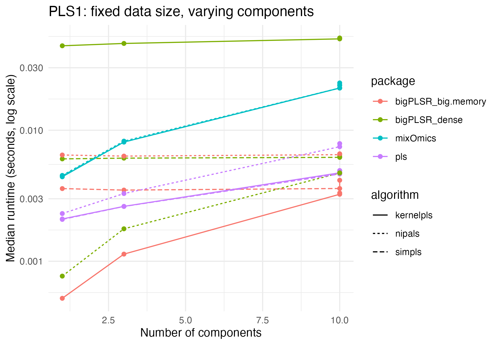
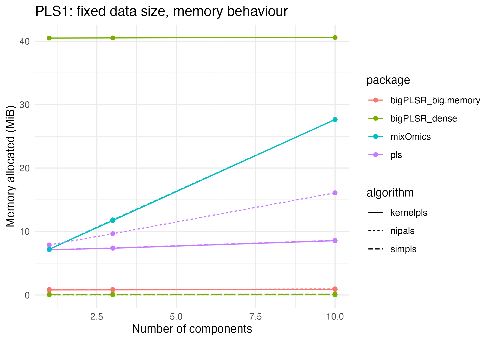
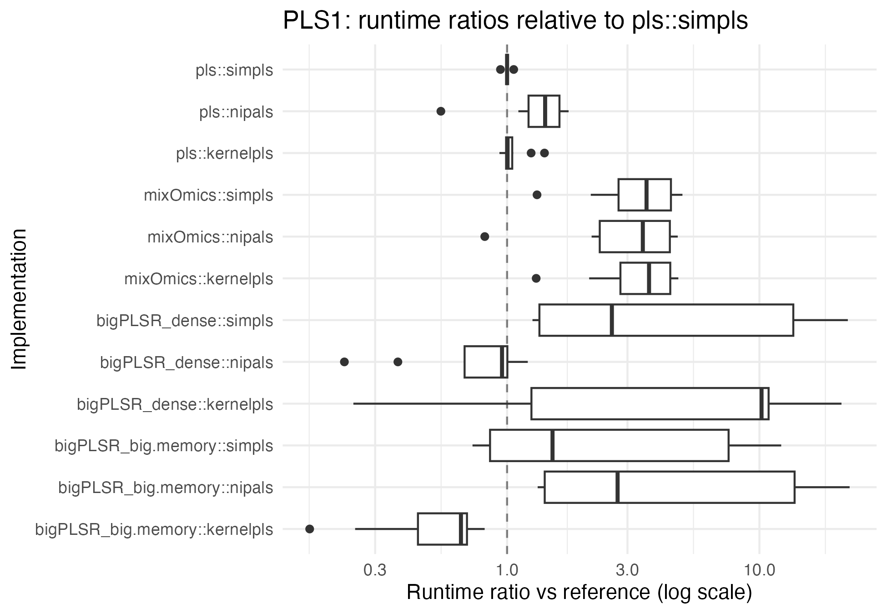
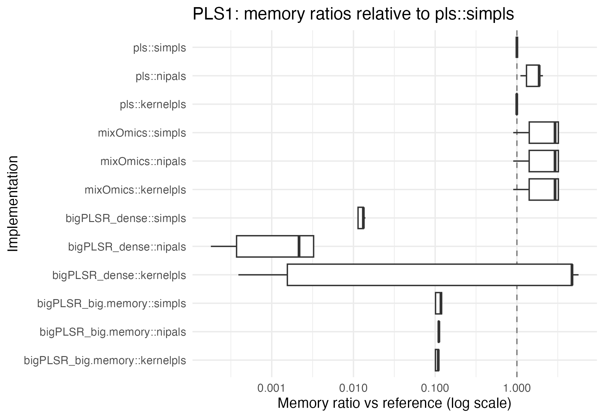
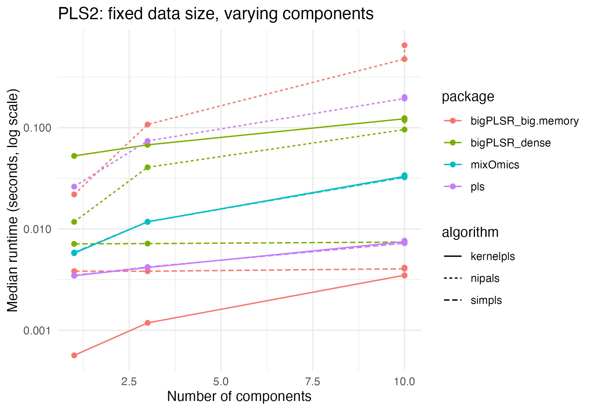
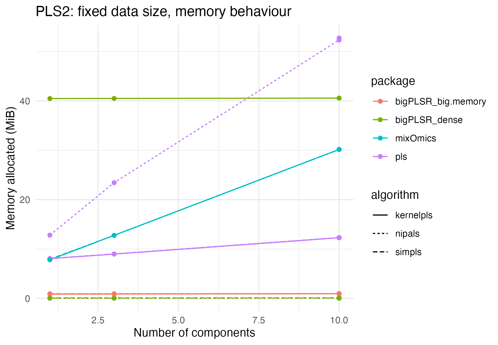
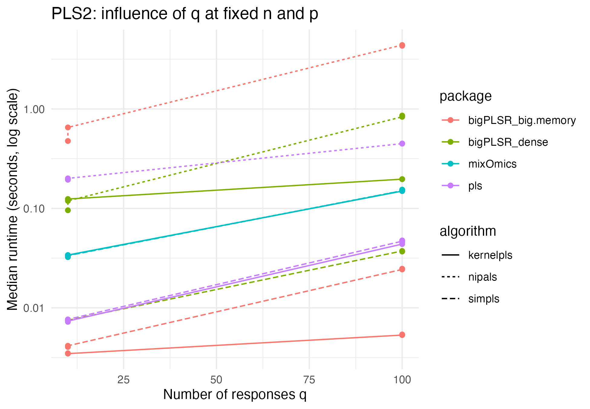
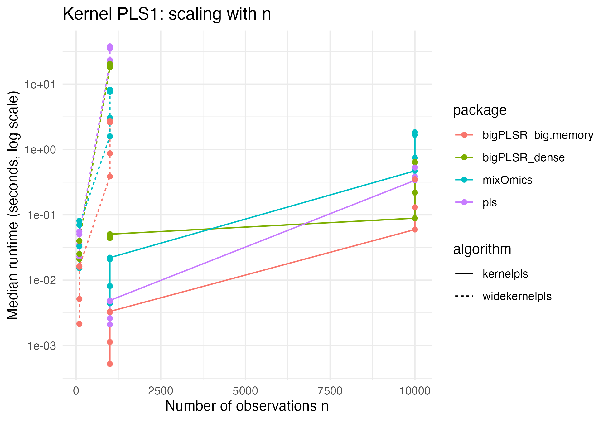

# External PLS benchmarks for bigPLSR: detailed analysis

``` r

knitr::opts_chunk$set(
  collapse = TRUE,
  comment  = "#>",
  fig.path = "figures/benchmark-long-",
  fig.width  = 6.5,
  fig.height = 4.5,
  dpi = 150,
  message = FALSE,
  warning = FALSE
)

LOCAL <- identical(Sys.getenv("LOCAL"), "TRUE")
```

## Introduction

This vignette presents a more detailed analysis of the external
benchmarks stored in `external_pls_benchmarks`. The dataset compares
`bigPLSR` dense and streaming implementations to reference PLS
implementations available in other R packages.

The analysis is organised as follows.

- Section on the benchmark design and the structure of the dataset.
- Section on PLS1 behaviour, with emphasis on runtime and memory.
- Section on PLS2 behaviour, including wide response settings.
- Section comparing kernel based algorithms and wide kernel PLS.
- Short discussion and take home messages.

The code chunks are meant to be reproducible and can be adapted if you
update or extend the benchmark dataset.

## Benchmark design and data structure

``` r

library(bigPLSR)
library(ggplot2)
library(dplyr)
library(tidyr)
library(forcats)

data("external_pls_benchmarks", package = "bigPLSR")

head(external_pls_benchmarks)
#>   task algorithm            package median_time_s itr_per_sec mem_alloc_bytes
#> 1 pls1    simpls      bigPLSR_dense   0.006045184   165.15626          104720
#> 2 pls1    simpls bigPLSR_big.memory   0.003586762   275.94176          895872
#> 3 pls1    simpls                pls   0.002086736   469.94316         7479024
#> 4 pls1    simpls           mixOmics   0.004478861   223.44869         7550384
#> 5 pls1 kernelpls      bigPLSR_dense   0.044123503    22.66366        42461256
#> 6 pls1 kernelpls bigPLSR_big.memory   0.000521520  1733.62898          821328
#>      n   p q ncomp                                     notes
#> 1 1000 100 1     1      Run via pls_fit() with dense backend
#> 2 1000 100 1     1 Run via pls_fit() with big.memory backend
#> 3 1000 100 1     1                  Requires the pls package
#> 4 1000 100 1     1             Requires the mixOmics package
#> 5 1000 100 1     1      Run via pls_fit() with dense backend
#> 6 1000 100 1     1 Run via pls_fit() with big.memory backend
```

The key factors are:

- `task`: PLS1 versus PLS2,
- `algorithm`: SIMPLS, NIPALS, kernel PLS or wide kernel PLS,
- `package`: implementation provider,
- `n`, `p`, `q`: data dimensions,
- `ncomp`: number of extracted components.

The performance measures are:

- `median_time_s` and `itr_per_sec` for runtime,
- `mem_alloc_bytes` for memory consumption as reported by
  [`bench::mark`](https://bench.r-lib.org/reference/mark.html).

For the analyses below it is convenient to add a few helper variables.

``` r

bench <- external_pls_benchmarks %>%
  mutate(
    mem_mib      = mem_alloc_bytes / 1024^2,
    log_time     = log10(median_time_s),
    log_mem_mib  = log10(pmax(mem_mib, 1e-6)),
    impl         = paste(package, algorithm, sep = "::")
  )
```

We will often work conditionally on `task`, `n`, `p`, `q` and `ncomp` in
order to compare implementations on exactly the same configurations.

## PLS1: dense versus streaming

### Fixed size, varying number of components

We first focus on PLS1 problems and fix a representative data size. You
can adjust the selection below depending on the contents of your
benchmark runs.

``` r

pls1_sizes <- bench %>%
  filter(task == "pls1") %>%
  count(n, p, q, sort = TRUE)

pls1_sizes
#>       n     p q nn
#> 1  1000   100 1 48
#> 2 10000  1000 1 48
#> 3   100  5000 1 16
#> 4  1000 50000 1 16
```

For illustration we take the most frequent `(n, p, q)` triple and look
at runtime as a function of `ncomp`.

``` r

size_pls1 <- pls1_sizes %>% slice(1L) %>% select(n, p, q)

pls1_subset <- bench %>%
  semi_join(size_pls1, by = c("n", "p", "q")) %>%
  filter(task == "pls1")
```

``` r

ggplot(pls1_subset,
       aes(x = ncomp, y = median_time_s,
           colour = package, linetype = algorithm)) +
  geom_line() +
  geom_point() +
  scale_y_log10() +
  labs(
    x = "Number of components",
    y = "Median runtime (seconds, log scale)",
    title = "PLS1: fixed data size, varying components"
  ) +
  theme_minimal()
```



``` r

ggplot(pls1_subset,
       aes(x = ncomp, y = mem_mib,
           colour = package, linetype = algorithm)) +
  geom_line() +
  geom_point() +
  labs(
    x = "Number of components",
    y = "Memory allocated (MiB)",
    title = "PLS1: fixed data size, memory behaviour"
  ) +
  theme_minimal()
```



These plots allow you to compare how dense `bigPLSR` backends and
competitors scale as the number of latent components increases, without
mixing problem sizes.

### Relative speed and memory ratios

To better understand the relative behaviour we compute ratios with
respect to a chosen reference implementation, for example `pls::simpls`
when it is available in the dataset.

``` r

reference_impl <- "pls::simpls"

## 1) Reference rows for pls1
refs_pls1 <- bench %>%
  filter(task == "pls1", impl == reference_impl) %>%
  select(
    n, p, q, ncomp,
    time_ref = median_time_s,
    mem_ref  = mem_mib
  )

## 2) Join and compute ratios (only where a reference exists)
ratios_pls1 <- bench %>%
  filter(task == "pls1") %>%
  left_join(refs_pls1, by = c("n", "p", "q", "ncomp")) %>%
  filter(!is.na(time_ref), !is.na(mem_ref)) %>%
  mutate(
    rel_time = median_time_s / time_ref,
    rel_mem  = mem_mib      / mem_ref
  )

ggplot(ratios_pls1,
       aes(x = impl, y = rel_time)) +
  geom_hline(yintercept = 1, linetype = "dashed", colour = "grey50") +
  geom_boxplot() +
  coord_flip() +
  scale_y_log10() +
  labs(
    x = "Implementation",
    y = "Runtime ratio vs reference (log scale)",
    title = "PLS1: runtime ratios relative to pls::simpls"
  ) +
  theme_minimal()
```



``` r

ggplot(ratios_pls1,
       aes(x = impl, y = rel_mem)) +
  geom_hline(yintercept = 1, linetype = "dashed", colour = "grey50") +
  geom_boxplot() +
  coord_flip() +
  scale_y_log10() +
  labs(
    x = "Implementation",
    y = "Memory ratio vs reference (log scale)",
    title = "PLS1: memory ratios relative to pls::simpls"
  ) +
  theme_minimal()
```



These figures help to answer questions such as:

- How close is dense `bigPLSR` SIMPLS to classical implementations in
  terms of runtime for a given problem regime.
- For which domains the big memory streaming backends give substantial
  memory savings relative to fully dense algorithms.

## PLS2: multiple responses

### Fixed size, varying number of components

We now repeat the same type of analysis for PLS2 configurations.

``` r

pls2_sizes <- bench %>%
  filter(task == "pls2") %>%
  count(n, p, q, sort = TRUE)

pls2_sizes
#>       n     p   q nn
#> 1  1000   100  10 48
#> 2  1000   100 100 48
#> 3 10000  1000  10 48
#> 4 10000  1000 100 48
#> 5   100  5000  10 16
#> 6   100  5000 100 16
#> 7  1000 50000  10 16
#> 8  1000 50000 100 16
```

``` r

size_pls2 <- pls2_sizes %>% slice(1L) %>% select(n, p, q)

pls2_subset <- bench %>%
  semi_join(size_pls2, by = c("n", "p", "q")) %>%
  filter(task == "pls2")
```

``` r

ggplot(pls2_subset,
       aes(x = ncomp, y = median_time_s,
           colour = package, linetype = algorithm)) +
  geom_line() +
  geom_point() +
  scale_y_log10() +
  labs(
    x = "Number of components",
    y = "Median runtime (seconds, log scale)",
    title = "PLS2: fixed data size, varying components"
  ) +
  theme_minimal()
```



``` r

ggplot(pls2_subset,
       aes(x = ncomp, y = mem_mib,
           colour = package, linetype = algorithm)) +
  geom_line() +
  geom_point() +
  labs(
    x = "Number of components",
    y = "Memory allocated (MiB)",
    title = "PLS2: fixed data size, memory behaviour"
  ) +
  theme_minimal()
```



### Influence of the number of responses

When `q` grows, some implementations may move from a predictor limited
regime to a response limited regime. The dataset allows you to explore
this by fixing `n` and `p` and varying `q`.

``` r

pls2_q_grid <- bench %>%
  filter(task == "pls2") %>%
  count(n, p, q, sort = TRUE)

head(pls2_q_grid)
#>       n    p   q nn
#> 1  1000  100  10 48
#> 2  1000  100 100 48
#> 3 10000 1000  10 48
#> 4 10000 1000 100 48
#> 5   100 5000  10 16
#> 6   100 5000 100 16
```

You can adapt the following code to one or several grids of interest.

``` r

grid_example <- pls2_q_grid %>%
  slice(1L) %>%
  select(n, p)

pls2_q_subset <- bench %>%
  semi_join(grid_example, by = c("n", "p")) %>%
  filter(task == "pls2", ncomp == max(ncomp))

ggplot(pls2_q_subset,
       aes(x = q, y = median_time_s,
           colour = package, linetype = algorithm)) +
  geom_line() +
  geom_point() +
  scale_y_log10() +
  labs(
    x = "Number of responses q",
    y = "Median runtime (seconds, log scale)",
    title = "PLS2: influence of q at fixed n and p"
  ) +
  theme_minimal()
```



## Kernel and wide kernel PLS

Kernel based algorithms are available in both dense and wide kernel
flavours. They are often more sensitive to the number of observations
than linear PLS, because they rely on Gram matrices of size `n x n`.

Here we restrict the dataset to kernel based algorithms for visual
clarity.

``` r

bench_kernel <- bench %>%
  filter(algorithm %in% c("kernelpls", "widekernelpls"))
```

Example plot for PLS1:

``` r

kern_pls1 <- bench_kernel %>% filter(task == "pls1")

ggplot(kern_pls1,
       aes(x = n, y = median_time_s,
           colour = package, linetype = algorithm)) +
  geom_line() +
  geom_point() +
  scale_y_log10() +
  labs(
    x = "Number of observations n",
    y = "Median runtime (seconds, log scale)",
    title = "Kernel PLS1: scaling with n"
  ) +
  theme_minimal()
```



You can build similar plots for memory and for the PLS2 task. They make
it easy to check whether kernel implementations scale in the expected
way for your data regimes.

## Discussion and practical guidance

The figures in this vignette illustrate a few practical messages.

- On moderate dense problems where `n` and `p` fit comfortably in
  memory, `bigPLSR` dense SIMPLS can be used as a drop in alternative to
  classical PLS implementations. Runtime is usually close in practice
  and the code keeps the possibility of switching to streaming if
  required later.
- On large sample sizes, the big memory streaming backends avoid
  allocating dense score matrices when `scores = "none"` and keep memory
  bounded with respect to `n`. This is particularly relevant for PLS2
  and kernel based methods.
- Kernel PLS algorithms may benefit from careful choice of kernel
  parameters and from backends that reduce the memory footprint of
  `n x n` Gram matrices. The design of `bigPLSR` keeps these extensions
  in mind.

The benchmark dataset is part of the package so that the evidence behind
these statements remains transparent and reproducible. You can extend
the benchmarks with your own tasks and regenerate the figures by simply
adding rows to `external_pls_benchmarks`.
