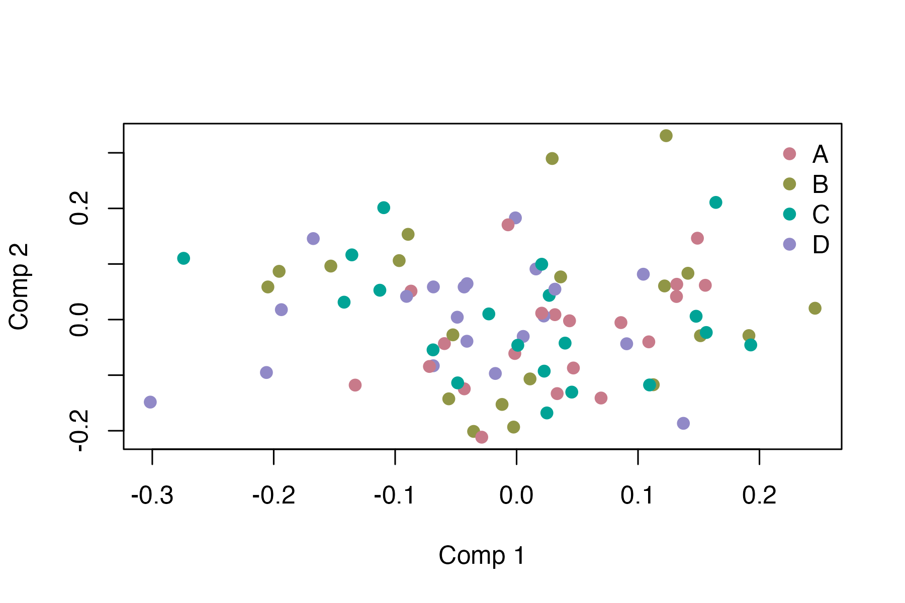
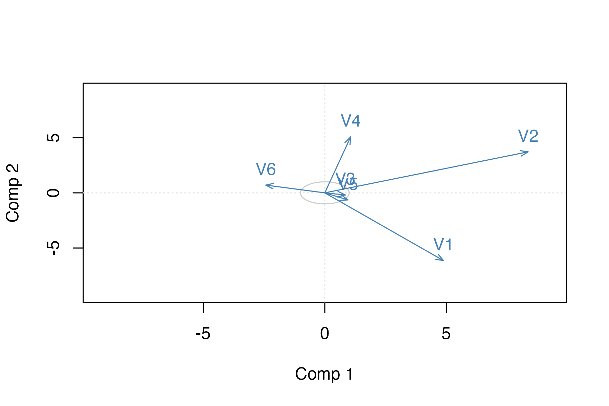
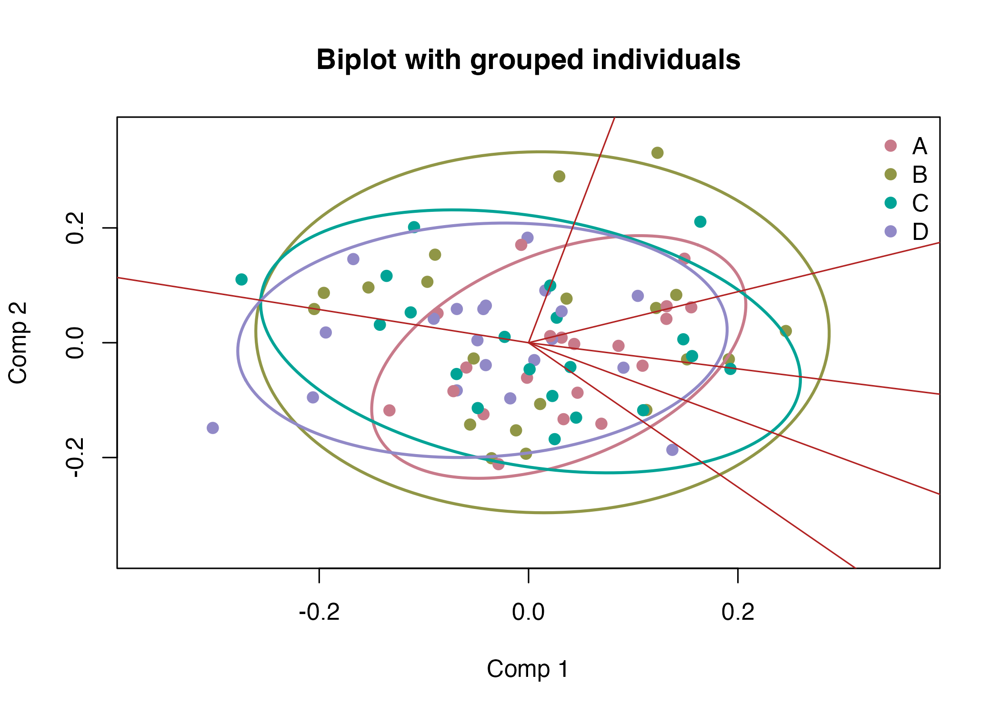
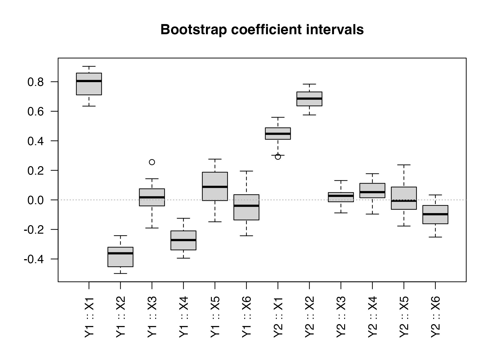

# Visualising PLS Fits with bigPLSR

``` r

library(bigPLSR)
set.seed(101)
```

## Example data

``` r

n <- 80; p <- 6
X <- matrix(rnorm(n * p), n, p)
Y <- scale(X[, 1:2] %*% matrix(c(0.7, -0.4, 0.5, 0.8), 2, 2) + rnorm(n * 2, sd = 0.15))

groups <- factor(rep(LETTERS[1:4], length.out = n))
fit <- pls_fit(X, Y, ncomp = 3, scores = "r")
```

## Score plots with ellipses

``` r

plot_pls_individuals(fit, comps = c(1, 2), groups = groups,
                     ellipse = TRUE, ellipse_level = 0.90, 
                     main="Component scores with 90% ellipses")
```



## Variable correlations and biplots

``` r

plot_pls_variables(fit, comps = c(1, 2), main="Variable plot")
```



``` r

plot_pls_biplot(fit, comps = c(1, 2), groups = groups,
                ellipse = TRUE, ellipse_level = 0.90, 
                main="Biplot with grouped individuals")
```



## Bootstrap summaries

``` r

boot <- pls_bootstrap(X, Y, ncomp = 2, R = 30, type = "xy",
                      parallel = "none", seed = 99)
summary_boot <- summarise_pls_bootstrap(boot)
summary_boot
#>    variable response         mean         sd percentile_lower percentile_upper
#> 1        X1       Y1  0.791966500 0.08475455       0.65091428       0.90289674
#> 2        X2       Y1 -0.380048683 0.08171928      -0.49781216      -0.25457028
#> 3        X3       Y1  0.012627990 0.09703593      -0.18655063       0.17408431
#> 4        X4       Y1 -0.270970620 0.07432352      -0.38062029      -0.15730963
#> 5        X5       Y1  0.080291163 0.12171747      -0.13147528       0.25938757
#> 6        X6       Y1 -0.046823538 0.11212752      -0.22609050       0.17094542
#> 7        X1       Y2  0.441409522 0.06951718       0.29938758       0.54873705
#> 8        X2       Y2  0.680267880 0.05902086       0.57777174       0.77117828
#> 9        X3       Y2  0.024624397 0.05236652      -0.07377591       0.12615176
#> 10       X4       Y2  0.058193995 0.07629797      -0.07393110       0.17107246
#> 11       X5       Y2  0.004567168 0.09882843      -0.16886315       0.15817355
#> 12       X6       Y2 -0.105158254 0.08187656      -0.24889987       0.02755033
#>      bca_lower   bca_upper
#> 1   0.63889624  0.90411438
#> 2  -0.49832691 -0.25254384
#> 3  -0.19046850  0.25161840
#> 4  -0.39465965 -0.20957578
#> 5  -0.14827809  0.27595767
#> 6  -0.24286724  0.17122482
#> 7   0.29520940  0.55900911
#> 8   0.63002240  0.78375488
#> 9  -0.08807535  0.13103953
#> 10 -0.09604065  0.17744844
#> 11 -0.15404991  0.23713080
#> 12 -0.25177682  0.01207836
```

``` r

plot_pls_bootstrap_coefficients(boot, main="Bootstrap coefficient intervals")
```



``` r

boot <- pls_bootstrap(X, Y, ncomp = 2, R = 30, type = "xy", 
                      parallel = "none", seed = 99, return_scores = TRUE)
plot_pls_bootstrap_scores(boot,main="Bootstrap score dispersion")
```


